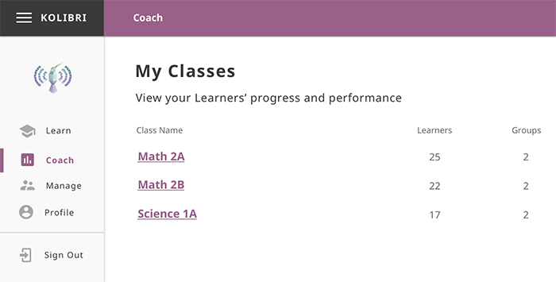
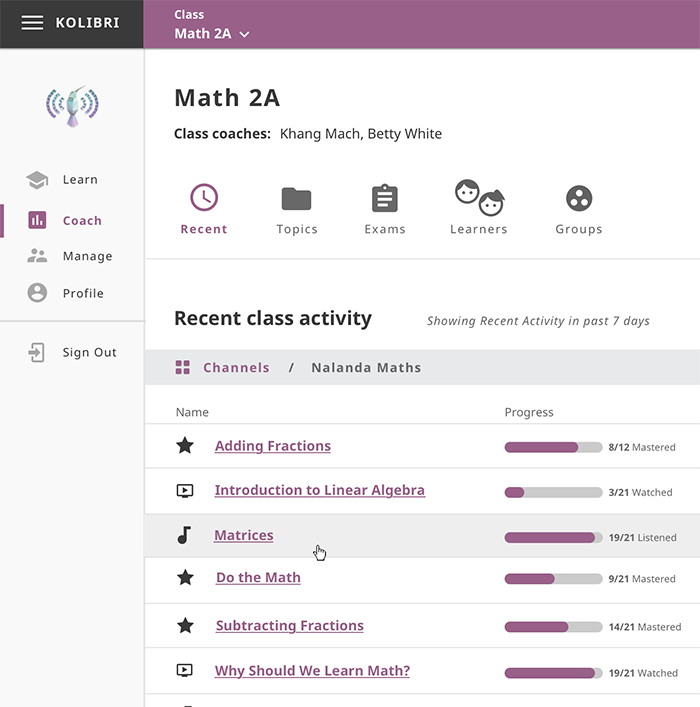
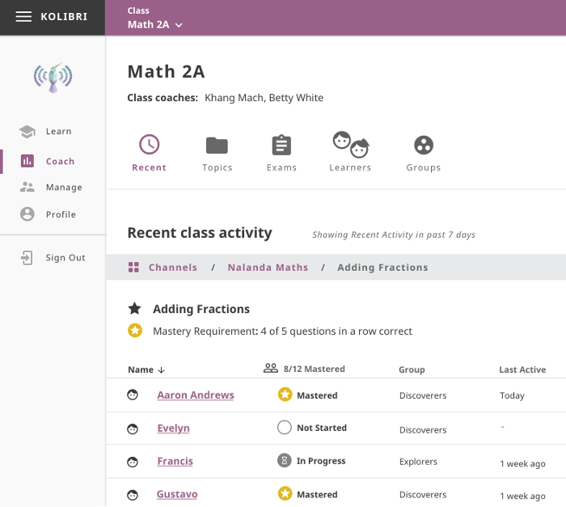

Coach
=====

.. warning::
  Coach dashboard is still under development. We strive to keep the documentation updated, but depending on the release version you have installed, screenshots of certain features may not correspond exactly.

You can track progress of the **Learner** users, create and assign **Exams** to classes or learner groups from the **Coach** dashboard. The default view of the **Coach** dashboard presents the list of **Classes** with number of learners enrolled to each class. 

Select a class from the list to access the progress-tracking features and create exams.

.. _recent_view:

Recent Activity View
~~~~~~~~~~~~~~~~~~~~

This is the default view when you select a class from the **Coach** dashboard. It displays the list of channels and items (exercises and resources - videos, reading material, etc.) accessed during the last 7 days by learners of the selected class.

If the class learners have access to more then one channel, you will first see the list of channels which you can navigate by topics and subtopics untill you arrive to a specific item. In this view you can see the progress of each class learner for that specific item.

.. _topic_view:

Full Activity View
~~~~~~~~~~~~~~~~~~~~

Use this view to access the full list of topics for the selected Kolibri channel, structured the same way as in Explore view.  

.. image:: img/coach_reports_topic.png
  :alt: coach reports activity by topic view

Learner Progress Detail
-----------------------

.. image:: img/learner_detail.png
  :alt: detail activity report for selected learner

.. _topic_progress_detail:

Topic Progress Detail
---------------------

.. image:: img/topic_detail.png
  :alt: detailed topic progress by learners

Sort Progress Columns
*********************

Weather you are exploring progress for a single user or specific topic, you click on the column headers to sort the user or topic activity by progress percentage.

.. image:: img/coach_reports_sort.png
  :alt: use column headers to sort the user activity

Filter Users (WIP)
******************

#. Use the drop-down selectors to filter the user activity by class, group or individual learners.
#. Click **View Report** button to create report.

.. image:: img/coach_reports_recent_filters2.png
  :alt: selectors to filter user activity in topic view

Toggle Channel/Learner View
***************************

Use the **Channel/Learner** switch to explore the user activity data as the *list of topics* or the *list of users*.

.. image:: img/channel_learner_switch.png
  :alt: toggle activity view between channel and learner

You can navigate the list of recently 
Clicking any of the items on the list will open the :ref:`topic_view` tab with :ref:`topic_progress_detail` report for that item by learners who accessed it.
