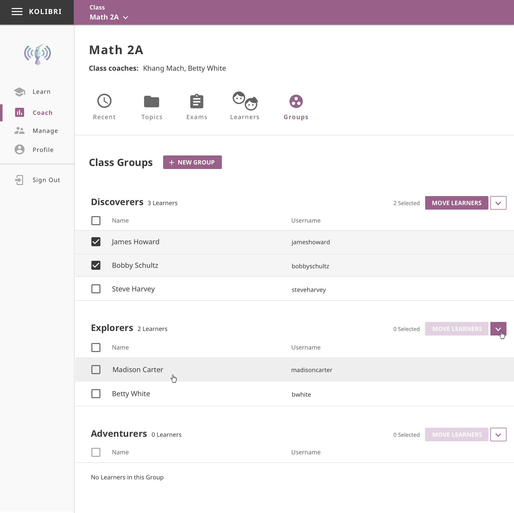
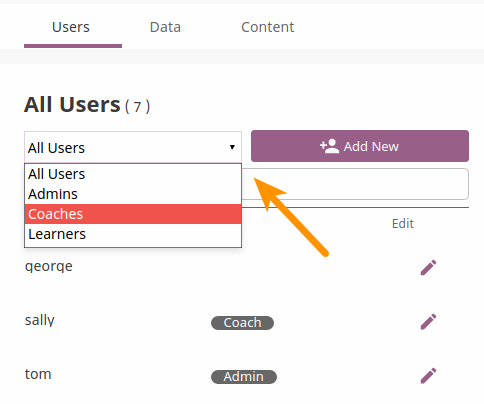
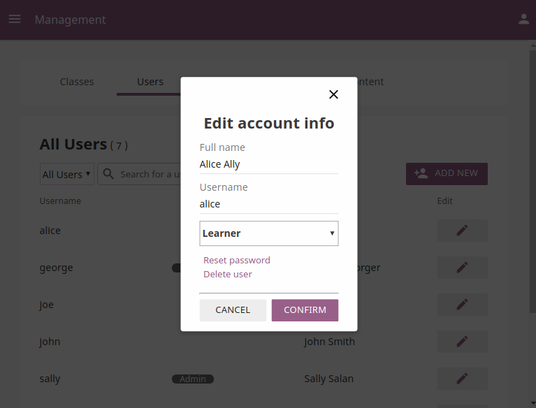
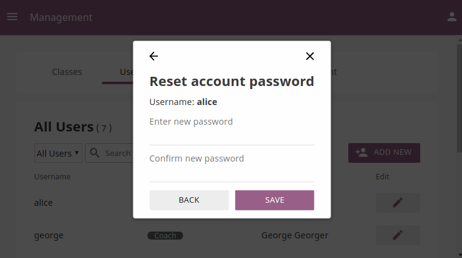
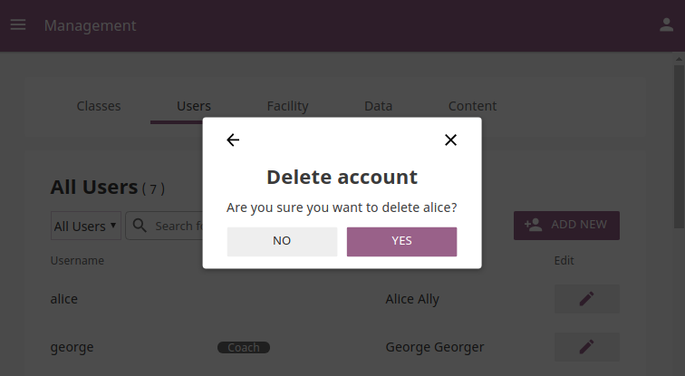

.. _manage_groups:

Manage Learner Groups
~~~~~~~~~~~~~~~~~~~~~

You can create groups and assign learners to them in Kolibri from the **Groups** tab in your **Coach** dashboard.

.. note::
  To manage groups of learners in Kolibri class you must be logged-in as **Coach**.

Create a New Group
------------------

To create a new learner group, follow these steps.

#. Click **+ New group** button.
#. Give group a desired name.
#. Click **Save** to confirm or **Cancel** to exit without creating a group.

.. image:: img/add_new_group.png
  :alt: add new group

Select Users by Type
--------------------

#. Click **All Users** selector to display user types. 
#. Toggle between options to filter the user roster according to type, or leave it as **All Users** to display all.

Edit User’s Account
-------------------

To edit username or the full name account, follow these steps.

#. Click on the **Edit** button (pencil icon) next to the user’s name.
#. Edit **Full name** or **Username** in the **Edit account info** window. 
#. Click **Confirm** to update the edited information or **Cancel** to exit without saving.

Reset User’s Password
*********************

#. Click **Reset password** in the **Edit account info** window. 
#. Enter the new password in both fields.
#. Click **Save** to confirm or **Back** to exit without changing the password.

Delete User’s Account
*********************

#. Click **Delete user** in the **Edit account info** window.
#. Click **Yes** to confirm or **No** to exit without deleting the account.

